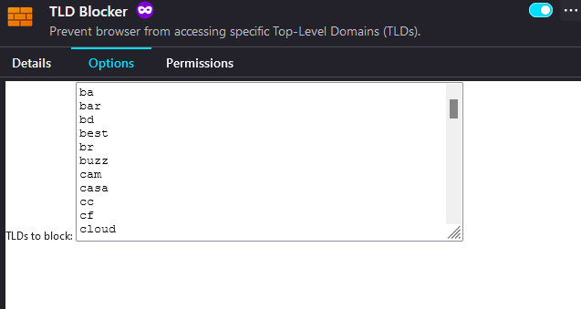

## Firefox Add-on

### Description
Prevent browser from accessing specific Top-Level Domains (TLDs).

🔗 [TLD Blocker Add-on](https://addons.mozilla.org/en-US/firefox/addon/tld-blocker/)

### About
TLD Blocker cancels a web request if web address contains a blocked-specified Top-Level Domain (TLD). TLD Blocker's "Options" tab contains the list of pre-populated TLDs. This list can be modified for specific needs.

The requirement for "Access your data for all websites" is only used to monitor and intercept web requests.

#### List of blocked TLDs



```
blockedTLDs = [
  "ba",
  "bar",
  "bd",
  "best",
  "br",
  "buzz",
  "cam",
  "casa",
  "cc",
  "cf",
  "cloud",
  "cn",
  "cyou",
  "digital",
  "email",
  "finance",
  "fun",
  "gq",
  "host",
  "icu",
  "id",
  "in",
  "ir",
  "ke",
  "link",
  "live",
  "lk",
  "ml",
  "monster",
  "ng",
  "np",
  "one",
  "online",
  "pe",
  "pk",
  "quest",
  "rest",
  "ru",
  "sa",
  "sbs",
  "shop",
  "site",
  "store",
  "su",
  "support",
  "surf",
  "th",
  "top",
  "tr",
  "tz",
  "uz",
  "vn",
  "website",
  "work",
  "xyz",
]
```
